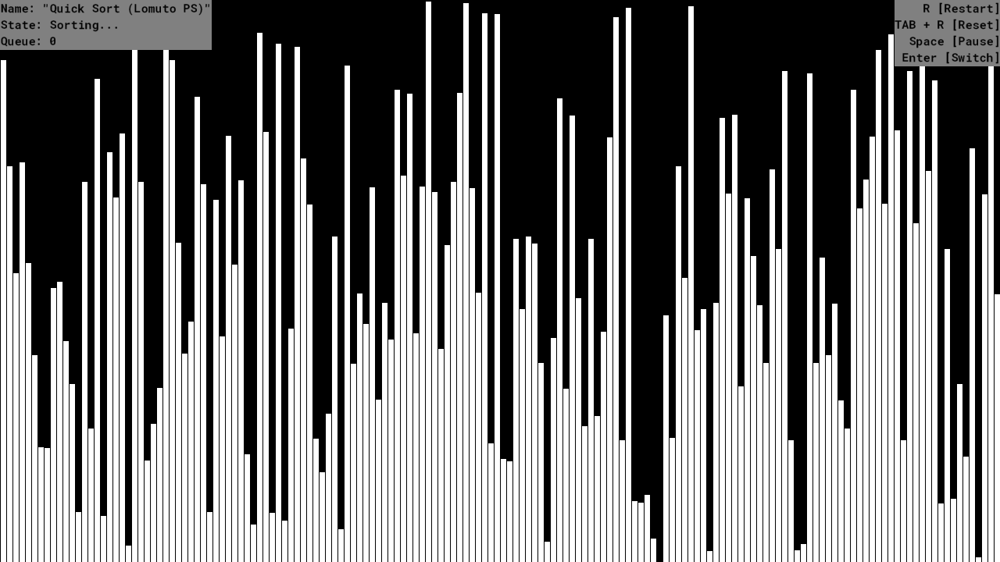

# Sorting Visualization
[Sorting](https://en.wikipedia.org/wiki/Sorting_algorithm) visualization that was written in Game Maker (Studio 2.3).

### Sorting Types
- [Bubble Sort](https://en.wikipedia.org/wiki/Bubble_sort).
- [Quick Sort](https://en.wikipedia.org/wiki/Quicksort) ([LPS](https://en.wikipedia.org/wiki/Quicksort#Lomuto_partition_scheme), [HPS](https://en.wikipedia.org/wiki/Quicksort#Hoare_partition_scheme)).
- [Bogo Sort](https://en.wikipedia.org/wiki/Bogosort).

### References
[Quick Sort Wikipedia](https://en.wikipedia.org/wiki/Quicksort) \
[Bubble Sort Wikipedia](https://en.wikipedia.org/wiki/Bubble_sort) \
[Bogo Sort Wikipedia](https://en.wikipedia.org/wiki/Bogosort)

### Preview

